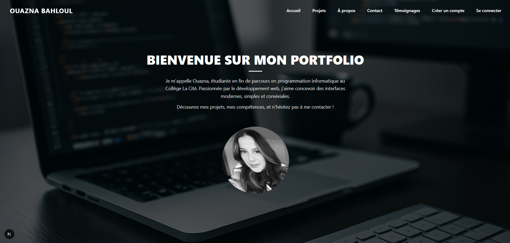
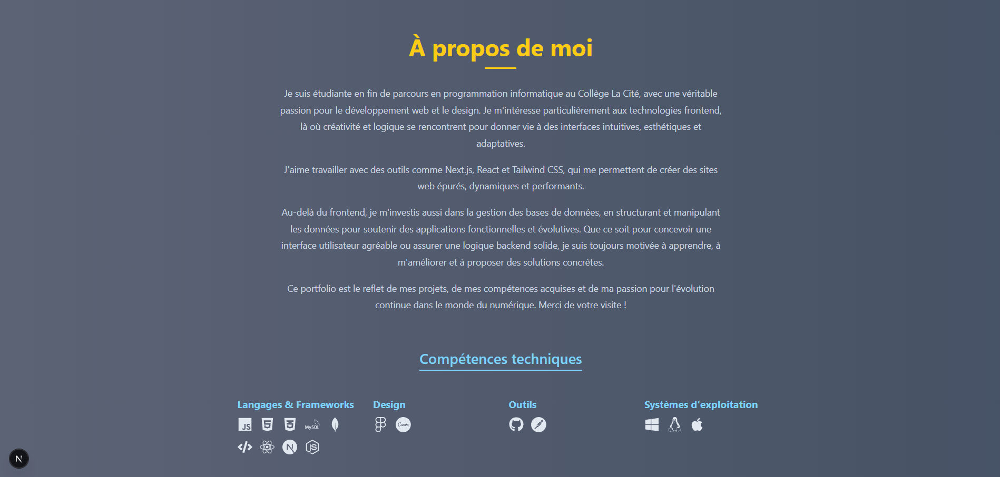
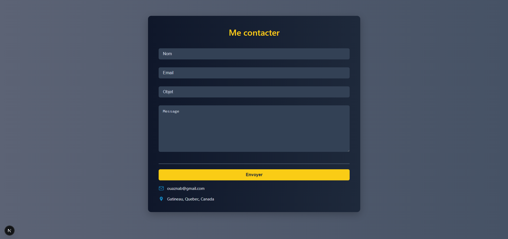
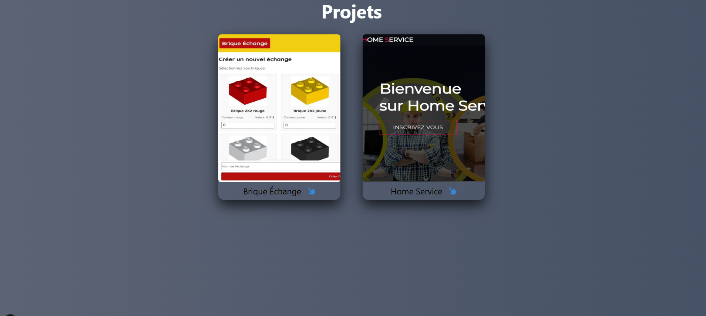
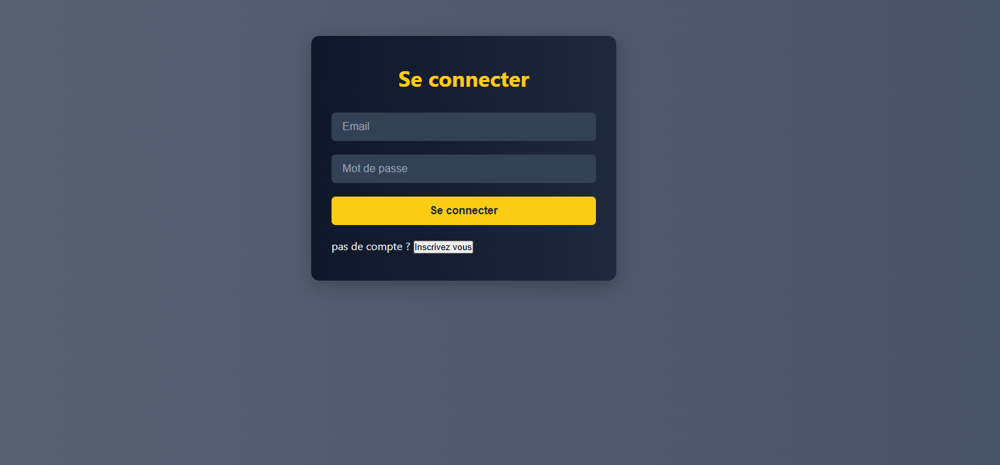
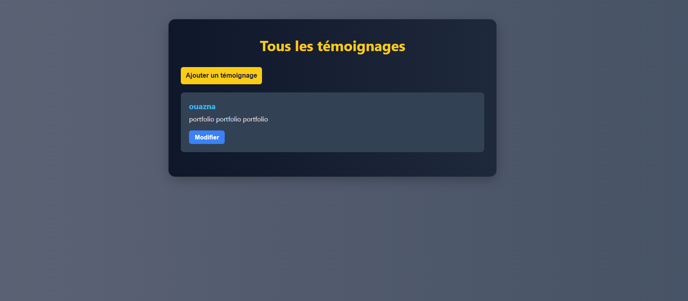

#  Portfolio Ouazna Bahloul

Bienvenue sur mon portfolio personnel réalisé avec **Next.js**.  
Ce projet met en avant mes compétences en **développement web frontend**, **design**, **bases de données**, et l'utilisation de **Redux**.
---
##  Technologies principales

-  Next.js
-  Redux Toolkit (auth, témoignages)
-  TailwindCSS / CSS Modules
-  EmailJS pour le formulaire de contact
##  Aperçus des pages

### Page d'accueil

### Page a propos

### Formulaire de contact

### Projets

### Formulaire de connexion

### Témoignages

---

##  Fonctionnalités de sécurité

-  **Pages protégées par l'authentification (Redux)**
  - Seules les personnes connectées peuvent accéder à :
    - `/about`
    - `/projects`
    - `/contact`
    - `/temoignage`
---
##  Fonctionnalités techniques

- Formulaire d'inscription / login (Redux)
- Formulaires avec validation côté client
- Ajout, affichage et modification de témoignages
- Formulaire de contact connecté à EmailJS
- Responsive design pour mobile, tablette, desktop
---
##  Arborescence simplifiée
